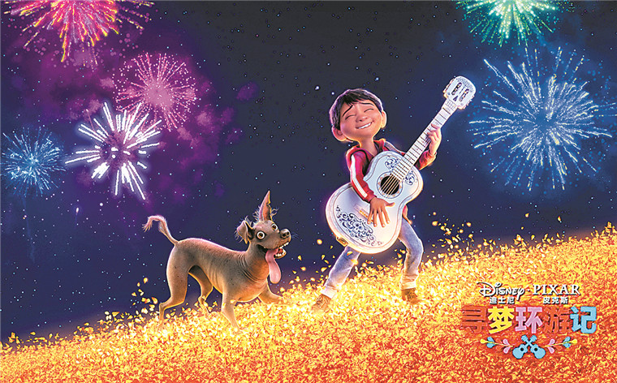

很久没有去电影院看电影，冲着寻梦环游记的高分去看，果然没有让我失望。

习惯每看完一本好书，或者一部好剧，好的电影，会去看它的书评、影评，每每会有言己不能言的感觉，非常的享受。这次既然决定自己写一点东西，就没有去看，以免被带节奏。所以我的解读，可能会不太一样。

电影整体的风格是比较欢快、搞笑的，很燃，但是又不缺乏思想高度，很多的情节可以反映出编剧的思考。观看的过程中会产生很多感悟，印象最深刻的，是埃克托去向老朋友借吉他的那一段。老朋友由于没有了在世的人的挂念，而不得不面对所谓的”终极死亡“。”死人的生命是由活人掌管的，当世上所有关于你的回忆都消失时，你才算真正的死亡。”这是埃克托的话（凭印象大概回忆的），给了我挺大的触动。这不正好诠释了那句名言，“有的人死了，但他还活着”吗？以前读这句话，大概就是理解为“伟人永远活在我们心中”。而电影里面，定义了“终极死亡”的概念，将这句话具体化，不得不说很妙。是啊，如果生活果真是这样的，那么或许死亡并不可怕，终极死亡才是真正的可悲！然而，古往今来，有多少人能够不面对“终极死亡”？几代人之后，大概都会归于尘土，从此再也没有人提起，想来也是唏嘘！

<!--more-->

也就是在这个桥段，我差不多猜到埃克托就是主人公的曾曾爷爷。这就不得不说到整部电影很严密，又很巧合的逻辑设计了。前面埃克托扫描通关时，没有自己的照片，这是一次伏笔；后来又弹了一段吉他，主人公听得入神，他还说自己跟歌神是朋友，这就说明他们有可能用过同一把吉他；然后主人公选歌的时候，他也有很多意见，种种伏笔，都已经很明显，但是这种巧合又不会让人感到讨厌，反而在最终揭露谜底的时候会心一笑。

类似的设计得很妙的，让人看起来很爽的情节，还有很多。比如歌神在跟他们一家子争论时，不知是哪个曾曾舅妈按了一下按钮，顿时真相公诸于众。还有一个很喜的画面，就是太奶奶去世之后，可爱地依偎在“爸爸”怀里的情景，让我觉得哇死亡也可以拍得那么温馨！

关于歌神这一角色，观影过程中做过无数次猜想，却无一正确。最开始以为他就是曾曾爷爷的时候，就觉得这个人物角色很矛盾，不得不在家人和音乐之间选一个。后来猜到他是曾曾爷爷的朋友时，就脑补着他拿着红叶送祝福却失效的情景……但这些都没有发生！等到事情真相一点点揭开，才发现歌神这个角色有多么的坏。为了自己的名誉，可以不择手段，甚至连疑似曾曾孙子的人都不放过。这里编剧借用歌神这一角色讽刺了一些外表光鲜，但是内心极其黑暗的人。同时又让曾曾爷爷洗了白，免于陷入家人、音乐择其一的困境，可谓一举两得。

关于这部电影的主题，我认为“寻梦”，寻的其实是家人之间的爱与理解。主人公的梦，看起来像是成为一名成功的音乐家，但是最终并没有提到他成为音乐家的“圆梦”结局。但是换来了一家人其乐融融的局面——包括死人和活人。最后那个一家人欢声笑语、歌舞升平的画面，我真的有被感动到。

