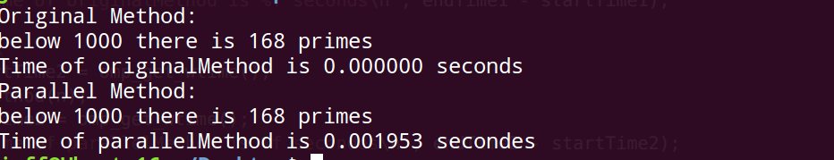
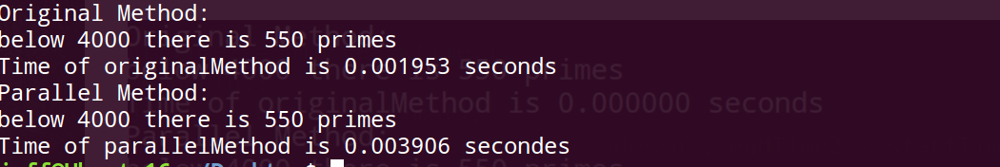
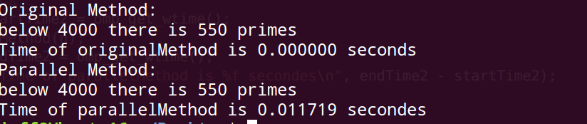
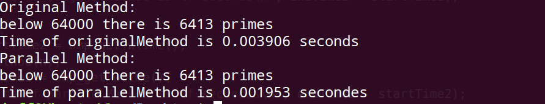
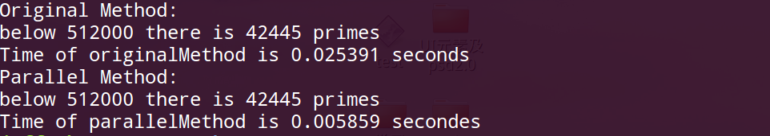
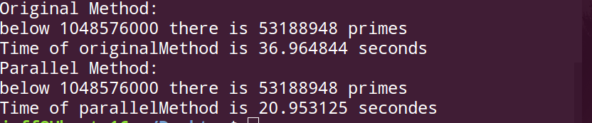

## 运行说明

硬件：Intel i5 四核四线程

软件：ubuntu 16.04 LTS   g++编译器

命令：

在main.cpp的目录下依次输入以下两条命令，可以看到运行结果。

```
g++ main.cpp -o main -fopenmp
./main
```

<!--more-->

## 实验内容

基于openMP的埃氏筛法的并行化实现。

项目要求和代码链接：

> https://github.com/zhengjf9/ParallelComputing/tree/master/Erichsen%20sieve%20method

## 算法说明

参数和方法说明：

```
I ----------限定查找素数的范围为2的N次方乘以1000，实验中可以修改。
int main(); ---------主函数，对两种版本的算法进行计时并比较
void originalMethod(int n); ----------单线程的埃氏筛法
void parallelMethod(int n); ----------并行的埃氏筛法
void setFalse(bool *array, int loc, int sizeOfThread, int n);
----------由parallelMethod方法调用，用来在不同线程中查找当前数的倍数的下标，并返回给主线程
void count(bool * array, int n);
----------由parallelMethod方法调用，执行完埃氏算法后对bool数组中的true进行计数
```

单线程方法：

采用遍历的方法，找到当前第一个素数（数组中置为true的），然后将范围中该素数的所有倍数都置为false。重复此过程直到遍历结束。统计数组中true的个数即为素数的个数。输出所用时间。

并行化算法：

- 实验环境为四核四线程，所以设置4个线程，并将范围内的数分为四部分。
- 利用opm的for循环进行初始化：
- 重复以下过程：找到当前数组中第一个为true的元素，并将其传递给其他线程。其他线程各自找到这些数的倍数并将他们置为false。
- 对结果数组进行计数，true的个数即为素数的个数。输出所用时间。

## 结果分析

I=0：



I=2：



I = 5：



I=6：



I=9：



I=20：



从图中可以看出，当I等于0到5的时候，并行化程序所用的时间比单线程要长，并行化的优势并没有显示出来，这是因为当数目比较小时，线程的创建、共享变量的读取等在这种情况下耗时的比重比较大。随着I的增大，程序所用的时间急剧增加，并行化程序的优化逐渐更加明显地体现出来。


