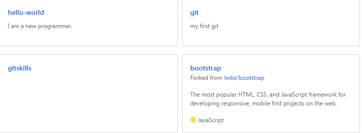
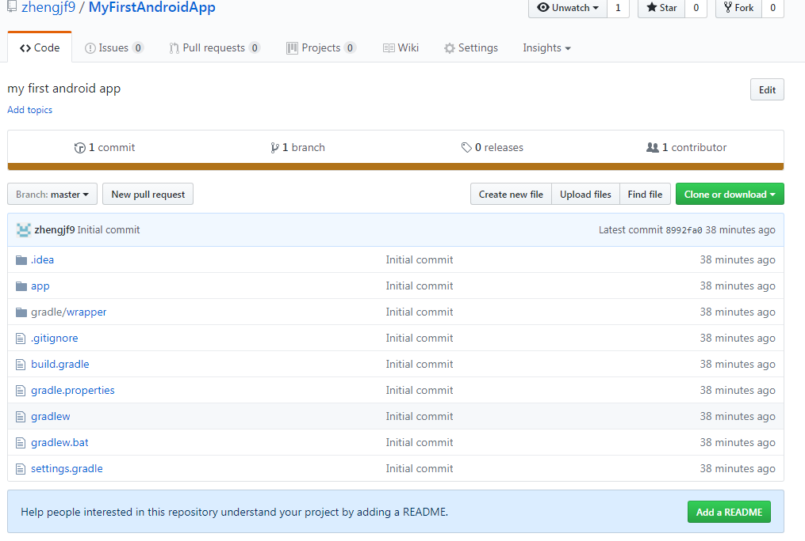

## 实验题目

Git的学习

## 实验内容

1.学习使用Git并创建自己的github账号。

2.学习使用Android Studio的git工具。

<!-- more -->

## 实验结果

1.实验截图

学习使用Git工具后，上传本地项目到github账号，并尝试进行增删改操作。再从其他github账户下“Fork”bootstrap项目到自己账户，克隆到本地。截图如下：

 

利用Android Studio的git工具lab1的项目push到github。截图如下：

实验步骤以及关键代码
--------------------

Git的主要操作如下：（摘自廖雪峰的官方网站-Git教程，方便后面回顾）

> https://www.liaoxuefeng.com/wiki/0013739516305929606dd18361248578c67b8067c8c017b000

* 初始化一个Git仓库，使用git init命令。

* 添加文件到Git仓库，分两步：

​        第一步，使用命令`git add \<file\>`，注意，可反复多次使用，添加多个文件；

​        第二步，使用命令`git commit`，完成。

* 要随时掌握工作区的状态，使用`git status`命令。

​        如果`git status`告诉你有文件被修改过，用`git diff`可以查看修改内容。

​        HEAD指向的版本就是当前版本，因此，Git允许我们在版本的历史之间穿梭，使用命令

​        `gitreset --hard commit_id`。

* 穿梭前，用`git log`可以查看提交历史，以便确定要回退到哪个版本。

​       要重返未来，用`git reflog`查看命令历史，以便确定要回到未来的哪个版本。

​        场景1：当你改乱了工作区某个文件的内容，想直接丢弃工作区的修改时，用命令

​        ` git checkout -- file`。

​        场景2：当你不但改乱了工作区某个文件的内容，还添加到了暂存区时，想丢弃修改，

​        分两步，第一步用命令git
​        `reset HEAD file`，就回到了场景1，第二步按场景1操作。

* 命令`git rm`用于删除一个文件。如果一个文件已经被提交到版本库，那么你永远不用担心误删，但

  是要小心，你只能恢复文件到最新版本，你会丢失最近一次提交后你修改的内容。

* 要关联一个远程库，使用命令`git remote add origin git@server-name:path/repo-name.git`；

​        关联后，使用命令`git push -u origin maste`r第一次推送master分支的所有内容；

​        此后，每次本地提交后，只要有必要，就可以使用命令`git push origin master`推送最新修改；

* 要克隆一个仓库，首先必须知道仓库的地址，然后使用`git clone`命令克隆。

* Git支持多种协议，包括https，但通过ssh支持的原生git协议速度最快。

* Git鼓励大量使用分支：

​        查看分支：`git branch`

​        创建分支：`git branch <name>`

​        切换分支：`git checkout <name>`

​        创建+切换分支：`git checkout -b <name>`

​        合并某分支到当前分支：`git merge <name>`

​        删除分支：`git branch -d <name>`

​        当Git无法自动合并分支时，就必须首先解决冲突。解决冲突后，再提交，合并完成。

​        用git log --graph命令可以看到分支合并图。

​        Git分支十分强大，在团队开发中应该充分应用。

​        合并分支时，加上--no-ff参数就可以用普通模式合并，合并后的历史有分支，能看出来

​         曾经做过合并，而`fast forward`合并就看不出来曾经做过合并。

* 修复bug时，我们会通过创建新的bug分支进行修复，然后合并，最后删除；

​        当手头工作没有完成时，先把工作现场`git stash`一下，然后去修复bug，修复后，再

​       `git stash pop`，回到工作现场。

* 开发一个新feature，最好新建一个分支；

​        如果要丢弃一个没有被合并过的分支，可以通过`git branch -D \<name\>`强行删除。

* 查看远程库信息，使用`git remote -v`；

​       本地新建的分支如果不推送到远程，对其他人就是不可见的；

​       从本地推送分支，使用`git push origin branch-name`，如果推送失败，先用

​       `git  pull`抓取远程的新提交；

​       在本地创建和远程分支对应的分支，使用`git checkout -b branch-name origin/branch-name`， 

​       本地和远程分支的名称最好一致；

​       建立本地分支和远程分支的关联，使用`git branch --set-upstream `

​      `branch-name origin/branch-name`；

​      从远程抓取分支，使用`git pull`，如果有冲突，要先处理冲突。

* 命令`git tag <name>`用于新建一个标签，默认为HEAD，也可以指定一个commit id；

​       `git tag -a <tagname> -m "blablabla..."`可以指定标签信息；

​       `git tag -s <tagname> -m "blablabla..."`可以用PGP签名标签；

​       命令`git tag`可以查看所有标签。

​       命令`git push origin <tagname>`可以推送一个本地标签；

​       命令`git push origin --tags`可以推送全部未推送过的本地标签；

​       命令`git tag -d <tagname>`可以删除一个本地标签；

​       命令`git push origin :refs/tags/<tagname>`可以删除一个远程标签。

## 实验遇到困难以及解决思路

廖雪峰的学习网站-Git教程主要以Linux下的操作为例，在windows下操作发现几处不同，收录如下：

* 显示文件内容用type不用cat。
* `git reset --hard HEAD^`命令由于^在windows命令行是特殊字符，所以应该加上双引号

实验思考及感想
------------------

很早就听过Git的大名，但是因为没用到所以一直没动力去学。这次实验课上老师要求去学，TA提供的教

程网站也非常的棒，所以就仔仔细细地跟着教程一步一步去做，前后大概花了好几个小时，总算明白了git

的基本操作，感觉受益匪浅。当然，一下子那么多指令也记不牢固，只有在后面边用边查，不断地熟悉，

才能真正变为自己的知识！