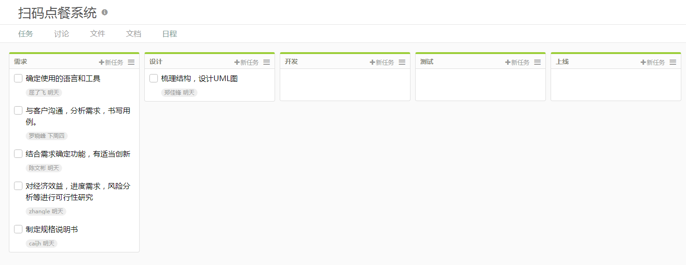

## 1.1 简述瀑布模型、增量模型、螺旋模型（含原型方法）的优缺点

>## 瀑布模型
>
>### 优点：
>
>- 为项目提供了按阶段划分的检查点
>- 当前一阶段完成后，您只需要去关注后续阶段。
>- 可在迭代模型中应用瀑布模型。
>
><!--more-->
>
>### 缺点：
>
>- 在项目各个阶段之间极少有反馈。
>- 只有在项目生命周期的后期才能看到结果。
>- 通过过多的强制完成日期和里程碑来跟踪各个项目阶段。
>
>## 增量模型
>
>### 优点：
>
>- 将待开发的软件系统模块化，可以分批次地提交软件产品，使用户可以及时了解软件项目的进展。
>- 以组件为单位进行开发降低了软件开发的风险。一个开发周期内的错误不会影响到整个软件系统。
>- 开发顺序灵活。开发人员可以对组件的实现顺序进行优先级排序，先完成需求稳定的核心组件。当组件的优先级发生变化时，还能及时地对实现顺序进行调整。
>
>### 缺点：
>
>- 增量粒度难以选择
>- 确定所有的基本业务服务比较困难
>
>## 螺旋模型
>
>### 优点：
>
>- 设计上的灵活性,可以在项目的各个阶段进行变更。
>- 以小的分段来构建大型系统,使成本计算变得简单容易。
>- 客户始终参与每个阶段的开发,保证了项目不偏离正确方向以及项目的可控性。
>- 随着项目推进,客户始终掌握项目的最新信息 , 从而他或她能够和管理层有效地交互。
>- 客户认可这种公司内部的开发方式带来的良好的沟通和高质量的产品。
>
>### 缺点：
>
>- 很难让用户确信这种演化方法的结果是可以控制的。建设周期长，而[软件](https://baike.baidu.com/item/%E8%BD%AF%E4%BB%B6)技术发展比较快，所以经常出现软件开发完毕后，和当前的技术水平有了较大的差距，无法满足当前用户需求。

## 1.2 简述 UP 的三大特点，其中哪些内容体现了用户驱动的开发，哪些内容体现风险驱动的开发？

>## 三大特点：
>
>- 用例驱动（用户驱动开发）：开发过程中用例和场景的使用被证明是捕获功能性需求的卓越方法，并确保由它们来驱动设计、实现和软件的测试，使最终系统更能满足最终用户的需要。
>- 以架构为中心：软件体系构架是关于构成系统的元素、这些元素之间的交互、元素和元素之间地组成模式以及作用在这些组成模式上的约束等方面的描述。
>- 受控的迭代式增量开发（风险驱动开发）：为了有效地控制风险，UP以渐进的方式进行演进，软件生命周期的每个阶段可以划分为多个迭代，每个迭代确定一个内部里程碑（或一个发布）。

## 1.3 UP 四个阶段的划分准则是什么？关键的里程碑是什么？

>## 划分标准：
>
>四个阶段根据开发生命周期中不同的关键里程碑划分 。
>
>## 关键里程碑
>
>**初始阶段：**生命周期目标(Lifecycle Objective) 里程碑，包括一些重要的文档，如：项目构想(Vision)、原始用例模型、原始业务风险评估、一个或者多个原型、原始业务案例等。需要对这些文档进行评审，以确定正确理解用例需求、项目风险评估合理、阶段计划可行等。
>
>**精化阶段：**生命周期体系结构(Lifecycle Architecture) 里程碑。包括风险分析文档、软件体系结构基线、项目计划、可执行的进化原型、初始版本的用户手册等。通过评审确定软件体系结构已经稳定、高风险的业务需求和技术机制已经解决、修订的项目计划可行等。
>
>**构建阶段 ：**初始运行能力(Initial Operational Capability) 里程碑。包括可以运行的软件产品、用户手册等，它决定了产品是否可以在测试环境中进行部署。此刻，要确定软件、环境、用户是否可以开始系统的运行。
>
>**产品化阶段/移交阶段 ：**产品发布(Product Release) 里程碑。确定最终目标是否实现，是否应该开始产品下一个版本的另一个开发周期。在一些情况下这个里程碑可能与下一个周期的初始阶段的相重合。

## 1.4 IT 项目管理中，“工期、质量、范围/内容” 三个元素中，在合同固定条件下，为什么说“范围/内容”是项目团队最易于控制的？

>在合同固定的条件下，一切都得按照合同的规定来进行。工期可能会由于对进度的把握不准或者遇到某些突发的难以解决的问题而导致延期；质量可能会由于工程师的水平不同而与预期有所偏差；而范围/内容是在合同中约定好的，也容易在实现的工程中及早发现问题并解决。所以说范围/内容”是项目团队最易于控制的。

## 1.5 为什么说，UP 为企业按固定节奏生产、固定周期发布软件产品提供了依据？

>因为这是一种有明确的划分阶段和里程碑的开发方法，每一阶段后有据可循。它将软件开发过程要素和软件工件要素整合在统一的软件工程框架中，划分了固定的时间阶段，定义了核心业务流程，为企业发布软件产品提供了依据。

## 2 项目管理使用

