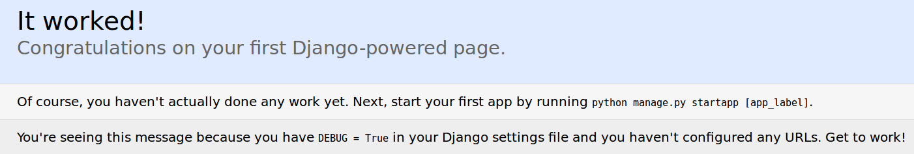
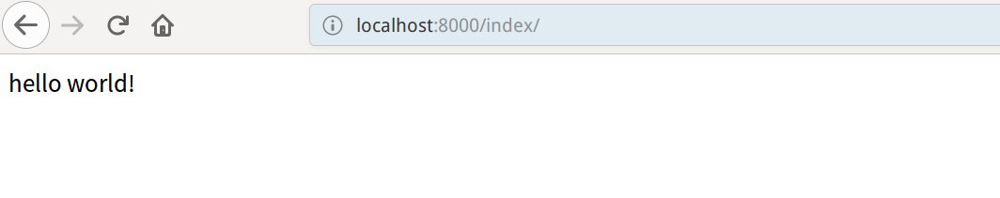

## Ubuntu下Django开发环境搭建

1、python环境搭建：

ubuntu自带python，使用python命令可以查看python版本。

```
jeff@Ubuntu16:~$ python
Python 2.7.12 (default, Dec  4 2017, 14:50:18) 
[GCC 5.4.0 20160609] on linux2
Type "help", "copyright", "credits" or "license" for more information.
```

安装ipython：ubuntu自带的python不带提示功能，安装ipython使开发更加方便。

```
sudo apt-get install ipython
```

<!--more-->

2、Django环境搭建：

```
sudo apt-get install python-django -y
```

安装目录在/usr/local/lib/python2.7/dist-packages下。

3、创建第一个：

切换到合适的目录下，创建一个工程。

```
django-admin startproject + 工程名
```

进入工程目录，使用tree命令查看目录。

```
.
├── manage.py
└── mysite1
    ├── __init__.py
    ├── settings.py
    ├── urls.py
    └── wsgi.py

1 directory, 5 files
```

依次输入以下两条命令运行工程。

```
python manage.py migrate
python manage.py runserver 0.0.0.0:8000（端口可以自定义）
```

在浏览器访问http://localhost:8000/，可以看到以下界面。



4、创建第一个项目：

输入以下指令创建一个项目：

```
django-admin startapp + 项目名
```

创建完目录如下：

```
.
├── admin.py
├── __init__.py
├── __init__.pyc
├── migrations
│   └── __init__.py
├── models.py
├── tests.py
├── views.py
└── views.pyc

1 directory, 8 files
```

配置路由：编辑urls.py文件如下，让路由指向views.py中的业务逻辑。

```
from django.conf.urls import include, url
from django.contrib import admin
from testapp import views

urlpatterns = [
    url(r'^admin/', include(admin.site.urls)),
    url(r'^index/',views.index),
]
```

业务逻辑函数：

```
from django.shortcuts import render
from django.shortcuts import HttpResponse

# Create your views here.

def index(request):
   return HttpResponse("hello world!")
```

保存后，再次运行工程。在浏览器访问http://localhost:8000/index，可以看到以下界面。

