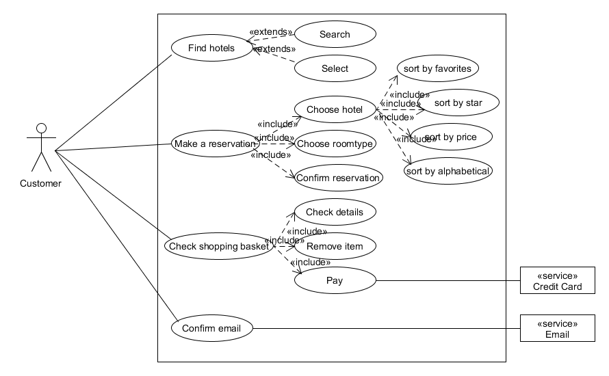
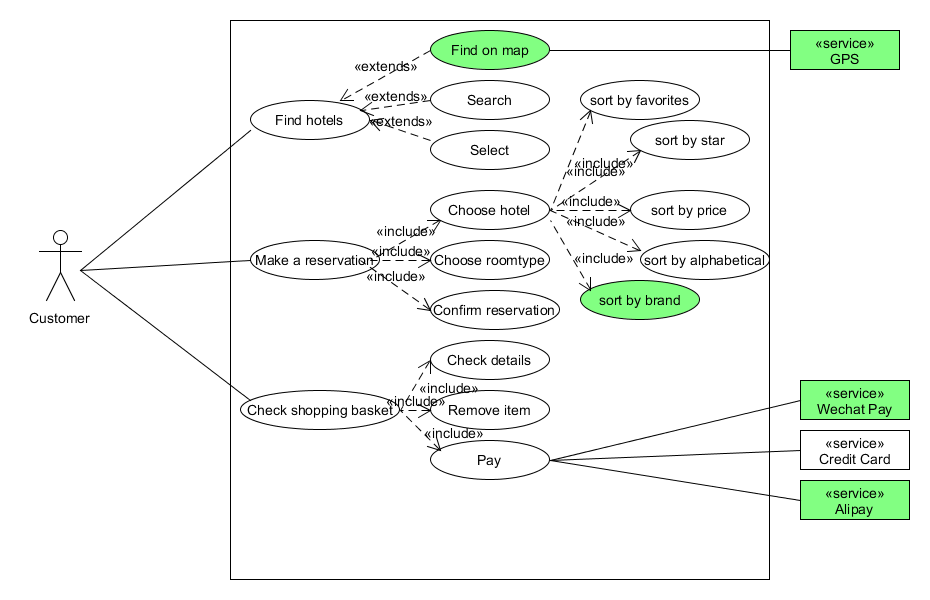
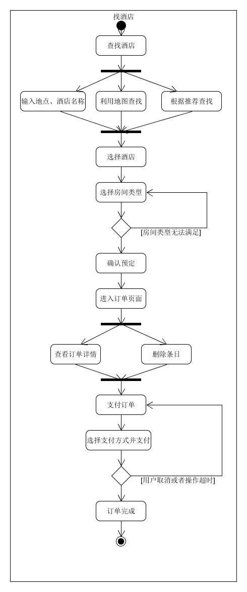
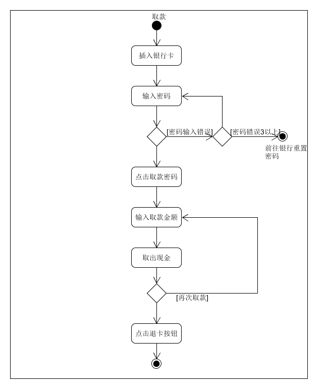
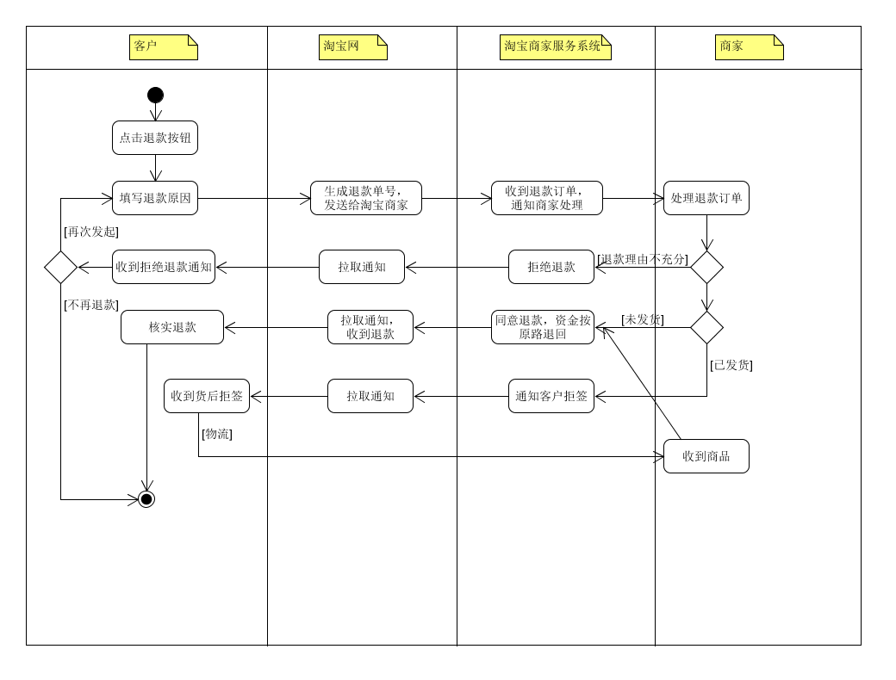

## 1、 用例建模

a、阅读 Asg_RH 文档，绘制用例图。 按 Task1 要求，请使用工具 UMLet，截图格式务必是 png 并控制尺寸。

<!--more-->

b、选择你熟悉的定旅馆在线服务系统（或移动 APP），如绘制用例图。并满足以下要求：

- 对比 Asg_RH 用例图，请用色彩标注出创新用例或子用例
- 尽可能识别外部系统，并用色彩标注新的外部系统和服务

以去哪儿网为例：

c、对比两个时代、不同地区产品的用例图，总结在项目早期，发现创新的思路与方法。

创新的思路和方法：

①站在用户的角度去思考，想想怎样才能使用户体验更好。如新的用例图中加入了使用地图搜索的功能。

​    将用户选择酒店的过程可视化，避免繁杂的输入。

②充分利用新的技术点改善用户体验。例如，现在的微信支付和支付宝支付已经横行市场，如果还坚持只

   支持银行卡支付的方式，会给用户带来很多不必要的麻烦。

d、 请使用 SCRUM 方法，在（任务b）用例图基础上，编制某定旅馆开发的需求 （backlog）。

| ID   | Name | Imp  | Est  | How to demo                              | Notes                                   |
| ---- | ---- | ---- | ---- | ---------------------------------------- | --------------------------------------- |
| 1    | 查找酒店 | 60   | 10   | 打开“去哪儿网”网页并点击“酒店模块，输入酒店或地点名查找酒店；或者点击地图搜索按钮进入地图选择；或者点击下方推荐的酒店。 | 推荐酒店时要根据用户常去的地方和酒店级别进行推荐，避免盲目推荐。        |
| 2    | 预定酒店 | 100  | 20   | 首先看到酒店列表，用户点击复选框可以改变排列方式，选中一家酒店，选择房间类型、数目，填写入住人信息，最后提交订单。 | 酒店排序方式尽量多样化，满足不同用户需求，包括价格、星级、品牌、口碑、字母序等 |
| 3    | 管理订单 | 40   | 5    | 进入订单页面后，用户选择要进行操作的订单，可以查看详情、删除或者支付。若支付，选择付款方式，成功付款后看到订单详情。 | 确保支付方式多样化并安全                            |

## 2、业务建模

a、在（任务b）基础上，用活动图建模找酒店用例。简述利用流程图发现子用例的方法。

利用流程图发现子用例的方法：在绘制流程图的过程中，分析每一步能否继续被细化，从而发现子用例。

b、选择你身边的银行 ATM，用活动图描绘取款业务流程

c、查找淘宝退货业务官方文档，使用多泳道图，表达客户、淘宝网、淘宝商家服务系统、商家等用户和系统协同完成退货业务的过程。分析客户要完成退货业务，在淘宝网上需要实现哪些系统用例

要完成退货业务，淘宝网至少需要完成生成退款订单并通知淘宝商家服务系统和拉取来自淘宝商家服务系统的通知两个用例。

## 3、用例文本编写

在大作业基础上，分析三种用例文本的优点和缺点

- 摘要用例：简洁的一段式概要，通常用于主成功场景
  - 优点：编写简单，使用方便
  - 缺点：无法详尽地描述用例内容
- 非正式用例：用几个段落覆盖不同场景
  - 优点：以段落的格式，简洁明了，比摘要更加详细，覆盖了多个不同场景
  - 缺点：还不够详细，无法直接作为设计开发的文档
- 详述用例：详细编写所有步骤及各种变化，同时具有补充部分，如前置条件和成功保证。
  - 优点：能详细描述所有的场景，包括步骤和各种变化
  - 缺点：编写用例的工作量大，需要多方面分析思考，多次修改

