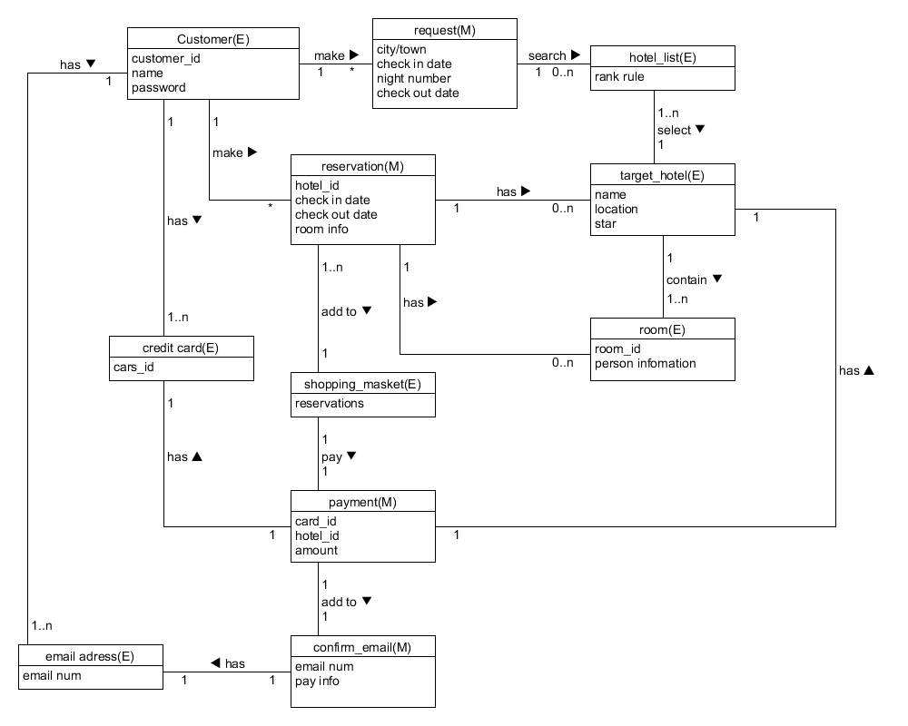
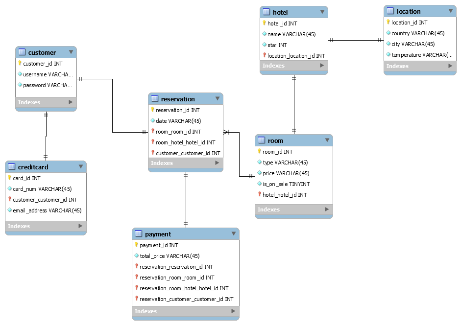

a. 阅读 Asg_RH 文档，**按用例**构建领域模型。

- 按 Task2 要求，请使用工具 UMLet，截图格式务必是 png 并控制尺寸
- 说明：请不要受 PCMEF 层次结构影响。你需要识别实体（E）和 中介实体（M，也称状态实体）
  - 在单页面应用（如 vue）中，E 一般与数据库构建有关， M 一般与 [store 模式](https://cn.vuejs.org/v2/guide/state-management.html) 有关
  - 在 java web 应用中，E 一般与数据库构建有关， M 一般与 session 有关

<!--more-->



b. 数据库建模(E-R 模型)

- 按 Task 3 要求，给出系统的 E-R 模型（数据逻辑模型）
- 建模工具 PowerDesigner（简称PD） 或开源工具 [OpenSystemArchitect](http://www.codebydesign.com/)
- 不负责的链接 <http://www.cnblogs.com/mcgrady/archive/2013/05/25/3098588.html>
- 导出 Mysql 物理数据库的脚本
- 简单叙说数据库逻辑模型与领域模型的异同

E-R模型：




导出脚本：

```
-- MySQL Script generated by MySQL Workbench
-- Mon Apr 30 13:00:36 2018
-- Model: New Model    Version: 1.0
-- MySQL Workbench Forward Engineering

SET @OLD_UNIQUE_CHECKS=@@UNIQUE_CHECKS, UNIQUE_CHECKS=0;
SET @OLD_FOREIGN_KEY_CHECKS=@@FOREIGN_KEY_CHECKS, FOREIGN_KEY_CHECKS=0;
SET @OLD_SQL_MODE=@@SQL_MODE, SQL_MODE='TRADITIONAL,ALLOW_INVALID_DATES';

-- -----------------------------------------------------
-- Schema mydb
-- -----------------------------------------------------

-- -----------------------------------------------------
-- Schema mydb
-- -----------------------------------------------------
CREATE SCHEMA IF NOT EXISTS `mydb` DEFAULT CHARACTER SET utf8 ;
USE `mydb` ;

-- -----------------------------------------------------
-- Table `mydb`.`customer`
-- -----------------------------------------------------
CREATE TABLE IF NOT EXISTS `mydb`.`customer` (
  `customer_id` INT NOT NULL AUTO_INCREMENT,
  `username` VARCHAR(45) NOT NULL,
  `password` VARCHAR(45) NOT NULL,
  PRIMARY KEY (`customer_id`))
ENGINE = InnoDB;


-- -----------------------------------------------------
-- Table `mydb`.`location`
-- -----------------------------------------------------
CREATE TABLE IF NOT EXISTS `mydb`.`location` (
  `location_id` INT NOT NULL,
  `country` VARCHAR(45) NOT NULL,
  `city` VARCHAR(45) NOT NULL,
  `temperature` VARCHAR(45) NOT NULL,
  PRIMARY KEY (`location_id`))
ENGINE = InnoDB;


-- -----------------------------------------------------
-- Table `mydb`.`hotel`
-- -----------------------------------------------------
CREATE TABLE IF NOT EXISTS `mydb`.`hotel` (
  `hotel_id` INT NOT NULL,
  `name` VARCHAR(45) NOT NULL,
  `star` INT NOT NULL,
  `location_location_id` INT NOT NULL,
  PRIMARY KEY (`hotel_id`, `location_location_id`),
  INDEX `fk_hotel_location1_idx` (`location_location_id` ASC),
  CONSTRAINT `fk_hotel_location1`
    FOREIGN KEY (`location_location_id`)
    REFERENCES `mydb`.`location` (`location_id`)
    ON DELETE NO ACTION
    ON UPDATE NO ACTION)
ENGINE = InnoDB;


-- -----------------------------------------------------
-- Table `mydb`.`room`
-- -----------------------------------------------------
CREATE TABLE IF NOT EXISTS `mydb`.`room` (
  `room_id` INT NOT NULL,
  `type` VARCHAR(45) NOT NULL,
  `price` VARCHAR(45) NOT NULL,
  `is_on_sale` TINYINT NOT NULL,
  `hotel_hotel_id` INT NOT NULL,
  PRIMARY KEY (`room_id`, `hotel_hotel_id`),
  INDEX `fk_room_hotel_idx` (`hotel_hotel_id` ASC),
  CONSTRAINT `fk_room_hotel`
    FOREIGN KEY (`hotel_hotel_id`)
    REFERENCES `mydb`.`hotel` (`hotel_id`)
    ON DELETE NO ACTION
    ON UPDATE NO ACTION)
ENGINE = InnoDB;


-- -----------------------------------------------------
-- Table `mydb`.`reservation`
-- -----------------------------------------------------
CREATE TABLE IF NOT EXISTS `mydb`.`reservation` (
  `reservation_id` INT NOT NULL,
  `date` VARCHAR(45) NOT NULL,
  `room_room_id` INT NOT NULL,
  `room_hotel_hotel_id` INT NOT NULL,
  `customer_customer_id` INT NOT NULL,
  PRIMARY KEY (`reservation_id`, `room_room_id`, `room_hotel_hotel_id`, `customer_customer_id`),
  INDEX `fk_reservation_room1_idx` (`room_room_id` ASC, `room_hotel_hotel_id` ASC),
  INDEX `fk_reservation_customer1_idx` (`customer_customer_id` ASC),
  CONSTRAINT `fk_reservation_room1`
    FOREIGN KEY (`room_room_id` , `room_hotel_hotel_id`)
    REFERENCES `mydb`.`room` (`room_id` , `hotel_hotel_id`)
    ON DELETE NO ACTION
    ON UPDATE NO ACTION,
  CONSTRAINT `fk_reservation_customer1`
    FOREIGN KEY (`customer_customer_id`)
    REFERENCES `mydb`.`customer` (`customer_id`)
    ON DELETE NO ACTION
    ON UPDATE NO ACTION)
ENGINE = InnoDB;


-- -----------------------------------------------------
-- Table `mydb`.`payment`
-- -----------------------------------------------------
CREATE TABLE IF NOT EXISTS `mydb`.`payment` (
  `payment_id` INT NOT NULL,
  `total_price` VARCHAR(45) NOT NULL,
  `reservation_reservation_id` INT NOT NULL,
  `reservation_room_room_id` INT NOT NULL,
  `reservation_room_hotel_hotel_id` INT NOT NULL,
  `reservation_customer_customer_id` INT NOT NULL,
  PRIMARY KEY (`payment_id`, `reservation_reservation_id`, `reservation_room_room_id`, `reservation_room_hotel_hotel_id`, `reservation_customer_customer_id`),
  INDEX `fk_payment_reservation1_idx` (`reservation_reservation_id` ASC, `reservation_room_room_id` ASC, `reservation_room_hotel_hotel_id` ASC, `reservation_customer_customer_id` ASC),
  CONSTRAINT `fk_payment_reservation1`
    FOREIGN KEY (`reservation_reservation_id` , `reservation_room_room_id` , `reservation_room_hotel_hotel_id` , `reservation_customer_customer_id`)
    REFERENCES `mydb`.`reservation` (`reservation_id` , `room_room_id` , `room_hotel_hotel_id` , `customer_customer_id`)
    ON DELETE NO ACTION
    ON UPDATE NO ACTION)
ENGINE = InnoDB;


-- -----------------------------------------------------
-- Table `mydb`.`creditcard`
-- -----------------------------------------------------
CREATE TABLE IF NOT EXISTS `mydb`.`creditcard` (
  `card_id` INT NOT NULL,
  `card_num` VARCHAR(45) NOT NULL,
  `customer_customer_id` INT NOT NULL,
  `email_address` VARCHAR(45) NOT NULL,
  PRIMARY KEY (`card_id`, `customer_customer_id`),
  INDEX `fk_creditcard_customer1_idx` (`customer_customer_id` ASC),
  CONSTRAINT `fk_creditcard_customer1`
    FOREIGN KEY (`customer_customer_id`)
    REFERENCES `mydb`.`customer` (`customer_id`)
    ON DELETE NO ACTION
    ON UPDATE NO ACTION)
ENGINE = InnoDB;


SET SQL_MODE=@OLD_SQL_MODE;
SET FOREIGN_KEY_CHECKS=@OLD_FOREIGN_KEY_CHECKS;
SET UNIQUE_CHECKS=@OLD_UNIQUE_CHECKS;
```

数据库逻辑模型与领域模型的异同:

相同点：两者都是将现实世界中的实体以及实体之间的关系用图形化的方式表示出来，便于开发者理解整个系统中的协作关系。

不同点：领域模型更加着重于描述关系，引入了中介实体。而数据库模型更加着重于刻画实体的内部属性。


