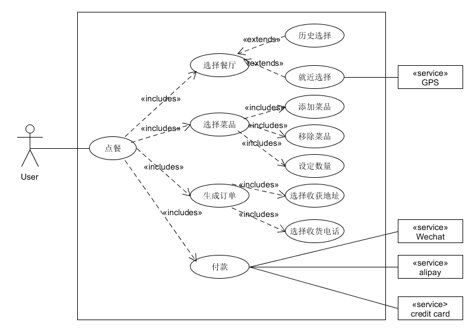
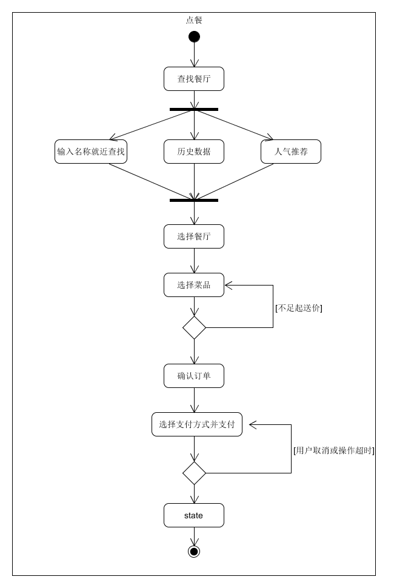
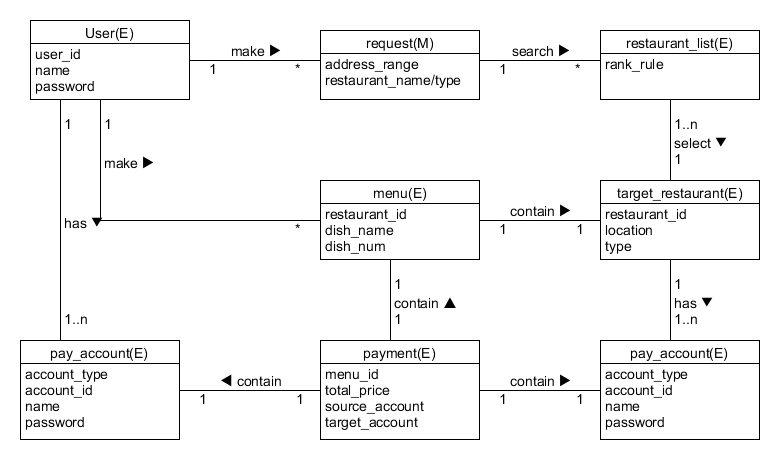
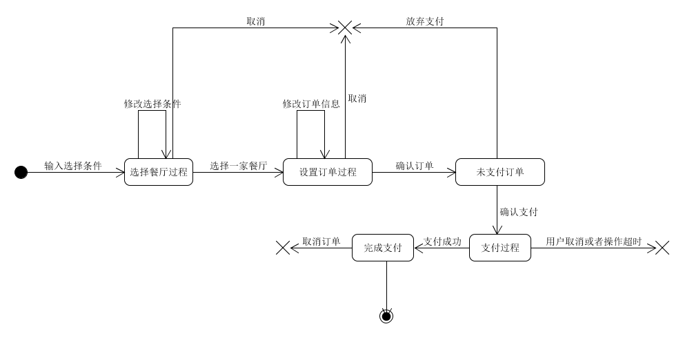
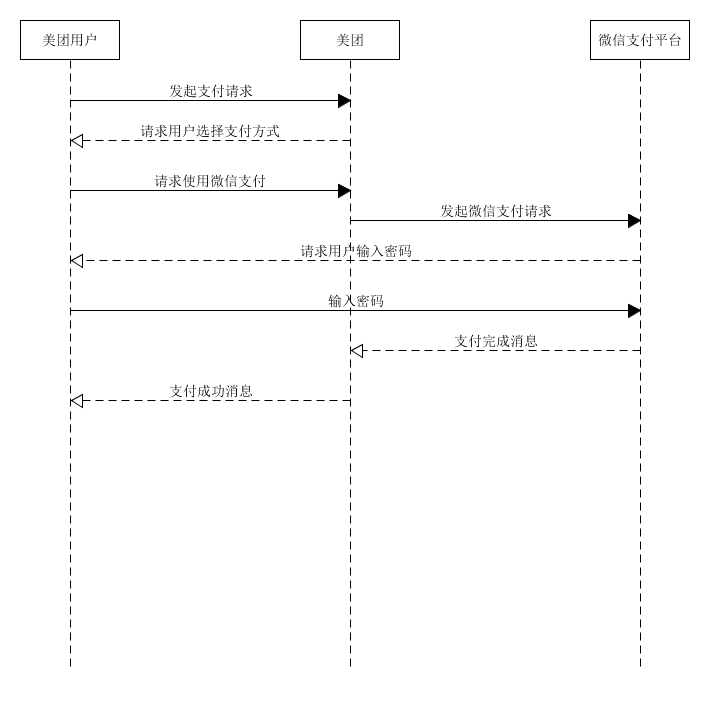

 ## 美团外卖建模练习 

要求：

- 练习文档编写
  - 选择一个你喜欢的 移动App 或 其中某业务
  - 参考 Asg_RH 文档格式 编写软件描述
  - 文档要包含一个业务的完整过程
- 建模要求包括（用例图、XX业务或用例的活动图、XX领域模型、XX对象的状态图、XX场景的系统顺序图与操作协议）

<!--more-->

### 建模要求文档

> https://github.com/EasyMealOrder/dashboard/blob/master/mid-term-exam/midTerm.pdf

**用例图：**

**点餐业务活动图：**

**点餐业务领域模型图：**

**用户点餐状态图：**

**微信支付场景的系统顺序图与操作协议：**

