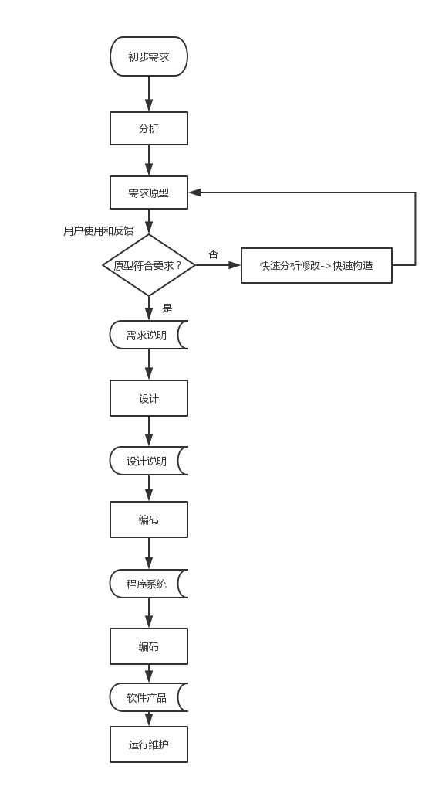
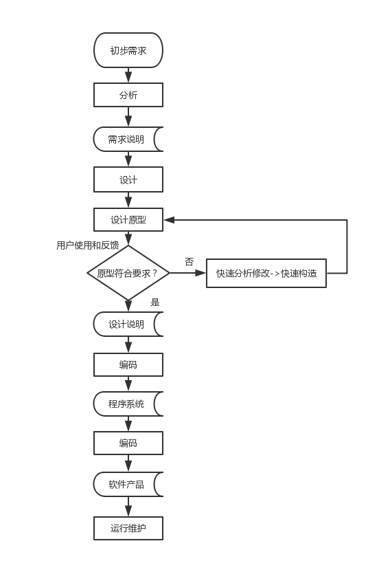
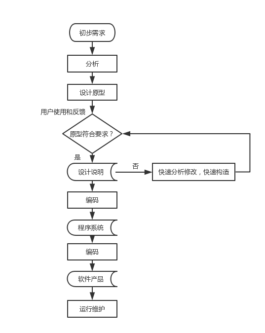
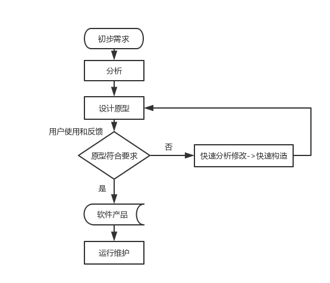

### 正确理解原型方法对软件生命周期不同阶段的支持，分别给出：辅助或代替分析阶段；辅助设计阶段；代替分析与设计阶段；代替分析、设计和实现阶段；代替全部开发阶段所对应的开发活动执行时间顺序。

**原型方法对软件生命周期不同阶段的支持：**

原型方法指在获得一组基本需求后，通过快速分析构造出一个小型的软件系统原型，用户通过使用原型系统，提出修改意见，从而减少用户与开发人员对系统需求的误解，使需求尽可能准确。原型方法主要用于明确需求，但也可以用于软件开发的其他阶段，包括设计阶段、实现阶段等。**下面给出原型方法辅助或代替分析阶段，辅助设计阶段，代替分析与设计阶段，代替分析、设计和实现阶段，代替全部开发阶段所对应的开发活动执行时间顺序。**

<!--more-->

**辅助或代替分析阶段**

**辅助设计阶段**

**代替分析与设计阶段**

**代替分析、设计和实现阶段**

**代替全部开发阶段**

